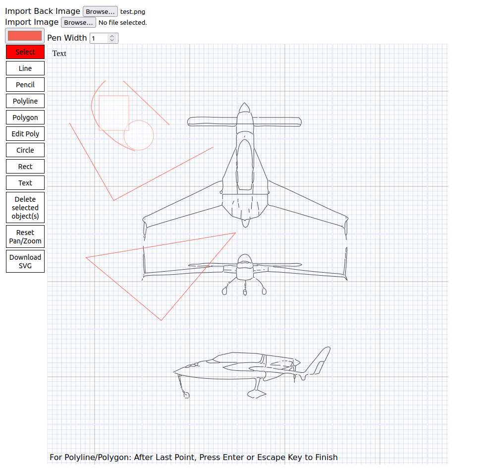

# Radsketch

## What is it?
Radsketch is a browser based 2D vector drawing program. It is intended as a minimal baseline template for basic use or others to improve upon. It has few dependencies (eg. jqueryjs and fabricjs). It is intended to be able to run locally without needing a local http file server.

## Usage
This app uses the Fabricjs 2D graphics library and takes advantage of its 2D object features. Any object may be stretched, scaled, and rotated. Note that the mouse wheel can be used to adjust the zoom and the right mouse button can be used to pan the canvas.
User Interface Summary:
- Import Back Image:  Allows a background image to be uploaded. Canvas size will be expanded it necessary.
- Import Image:  Allows image to be loaded to become a selectable display object.
- Pen Color and Pen Width:  The pen color and pen width are used for subsequent vector drawing objects.
- Select: Tool for neutral selection mode to get out of current drawing mode. Click on object to select. Multiple objects may be selected as a group by a click and drag operation.
- Line: Tool for drawing line segments may done in this mode by clicking on first point and dragging to the second point.
- Pencil: Tool for freehand drawing with the mouse, click and drag.
- Polyline: Tool for drawing polylines, click move, click move, ... click then press the Enter or Escape key for last point.
- Polygon: Tool for drawing polygons, works like polyline, but draws last line segment to close the polygon upon pressing Enter or Escape key.
- Edit Poly: Tool for editing points of selected polyline or polygon. Polyline or Polygon must be selected first. This functions as a toggle button, so the button must also be clicked again to end editing.
- Circle: Tool places a circle on the drawing. The user can then mouse edit and/or move the circle.
- Rect: Tool places a rectangle on the drawing. The user can then mouse edit and/or move the rectangle.
- Text:  Tool places a "Text" box on the drawing. The user can then mouse edit and/or move the text. Click on "Text" a second time after selection to enable the text cursor, so that the text may be changed.
- Delete selected object(s): Tool deletes the selected object(s).
- Reset Pan/Zoom: Tool resets the scale and position of the canvas to the original or Home state before any zoom or panning.
- Download SVG: Tool generates and downloads and "export.svg" file to the user's browser default download location.

## Dependencies
- [Fabric js](https://fabricjs.com/)
- [jquery js](https://jquery.com/)

## To-do
- Layout and user interface improvement
- Cubic spline curves
- Measurement Tools: distance, angle, ...
- Adjustable canvas size, units, snap ...
- Import drawing from SVG file

## Contributing to Radsketch
 
* You are welcome to take this code, make your own improvements, and make it your own.

## Copyright

Copyright (c) 2024 Jerry Radke, [MIT license](./license.txt)

